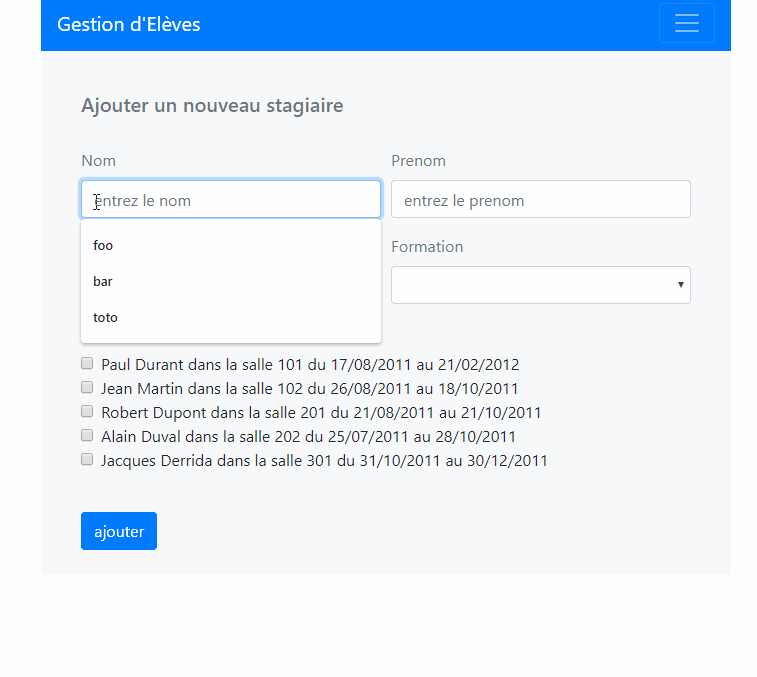

# Gestion Eleves

## training project with PHP

### trying out Object-Oriented Programming 
### Secured access to Database, encapsulation 
### Persistance of Data / CRUD 

### Work in progress 

#

#

